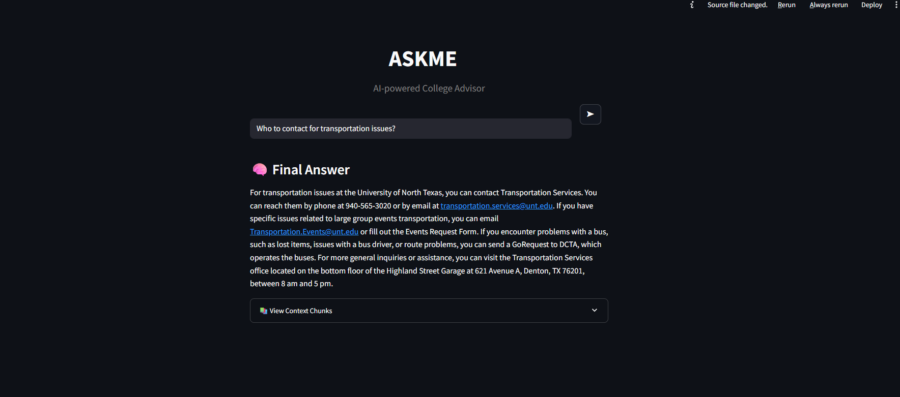
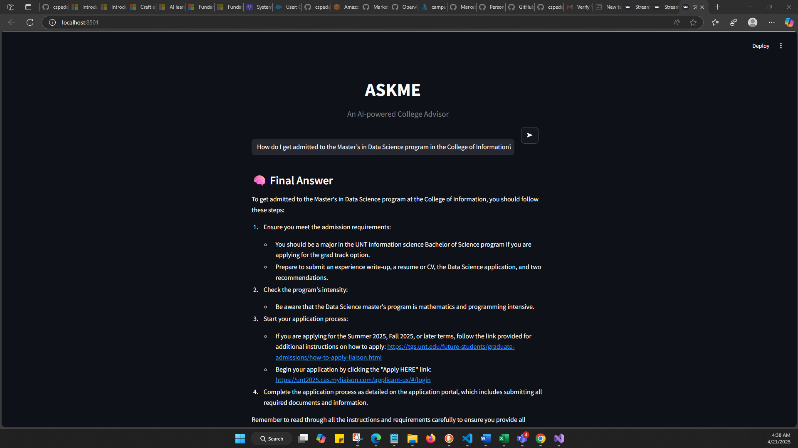
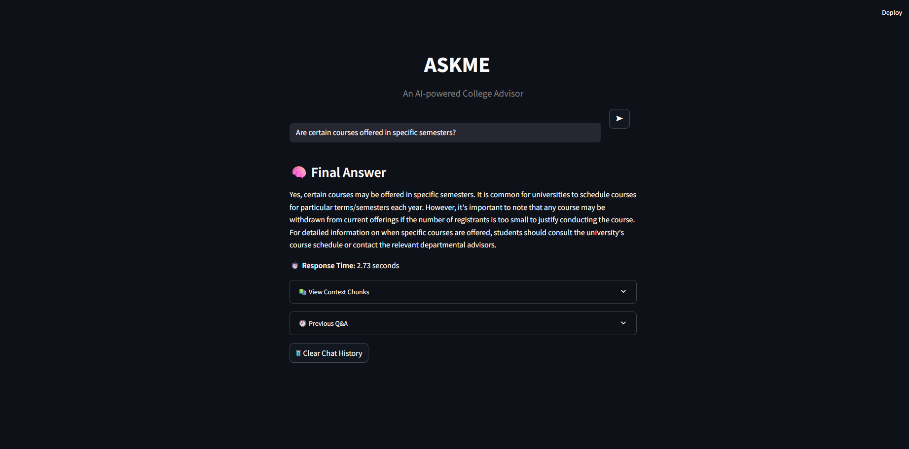

# ASKME - AI Support for Knowledge Management & Engagement
### GenAI-Powered College Advisor

ASKME is an intelligent GenAI-powered assistant designed to improve university support services. It delivers real-time, context-aware, and multilingual responses to student queries, with a strong focus on international student needs, by combining advanced NLP, Retrieval-Augmented Generation (RAG), and large language models (LLMs).

## Screenshots

### Interface Overview

### Sample Query 1

### Sample Query 2

### Sample Query 3

## Problem Statement

University departments are overwhelmed by thousands of repetitive queries each semester, resulting in:

- Long response delays during peak periods
- Inconsistent or incomplete information from different departments
- High dependency on limited staff hours
- Lack of 24/7 personalized assistance for critical student issues such as visas, scholarships, and course selection

ASKME addresses these issues by providing an AI-driven, always-available support system tailored to the academic environment.

## Objectives

- Automate academic and administrative FAQ responses using LLMs
- Support personalized and multilingual responses with context retention
- Reduce human staff workload and response wait times
- Build a scalable and accurate AI assistant for university environments
- Enable document-level understanding from PDF, web, and JSON content
- Track and log queries for analytics, feedback, and improvement

## Tech Stack

| Component | Tools / Frameworks |
| --- | --- |
| LLMs | GPT-4o, LLaMA 3.3 (70B) |
| NLP Frameworks | LangChain, SentenceTransformers |
| Embeddings | BAAI/bge-m3, Word2Vec, TF-IDF |
| RAG Framework | ChromaDB + LLM-based Generator |
| Data Collection | Web scraping, manual JSON construction |
| Preprocessing | PyMuPDF, regex, lowercasing, cleaning scripts |
| Backend/API | Python scripts, Flask, modular RAG pipeline |
| Frontend (UI) | HTML, CSS, JavaScript chat UI, Streamlit prototype |
| Deployment | Local testing, future Azure/Salesforce/AWS options |
| Evaluation Tools | Evidently AI, human reviews, BERTScore |

## Project Modules

### 1. Data Collection and Cleaning
- Parsed PDFs, DOCX, JSON, and TXT sources
- Manual extraction and filtering

### 2. Preprocessing Pipeline
- Regex cleanup
- Whitespace normalization
- Lowercase conversion

### 3. Knowledge Base Construction
- Chunking with RecursiveCharacterTextSplitter
- Sentence splitting with overlap for better context
- Embedding with SentenceTransformers using `BAAI/bge-m3`
- Storage with ChromaDB

### 4. RAG Pipeline
- Query vectorization and similarity search
- Reranking for higher relevance
- Prompt engineering and LLM context integration

### 5. Evaluation and Analytics
- Semantic similarity with BERTScore
- Faithfulness, correctness, completeness, and fluency checks
- Evidently AI metrics

### 6. UI and Interaction
- Chat interface for real-time question answering
- Local hosting with input logging and source traceability

## Results Summary

- BERTScore F1: `0.82-0.88`, indicating strong semantic overlap
- Human evaluation showed most responses were rated relevant and fluent
- Reranking improved context relevance over vanilla vector similarity
- GPT-4o responded faster than the Ollama-based setup in local testing

## Future Work

- Integrate agentic AI for workflow automation
- Improve dynamic context length control
- Expand multilingual and regional support
- Fine-tune LLMs on domain-specific Q&A
- Extend support for multimodal inputs
- Deploy the chatbot in a real-time production setting

## Authors

- Christian Bridge
- Chandrasekhar Pedalapu

---

## Project Structure Update (March 2026)

- The `pipeline/` folder has been moved to `backend/pipeline/` for better organization and future backend/API development.
- All backend logic, data processing, and core pipeline scripts are now under `backend/`.
- The rest of the project structure remains unchanged.

### Updated Folder Overview

- `backend/pipeline/`: Data processing, embedding, model routing, querying, and core pipeline logic
- `analysis/`: Jupyter notebooks and scripts for analysis, visualization, and evaluation
- `data/`: Raw and processed datasets (sensitive, not tracked by git)
- `output/`: Generated results, model outputs, and pipeline artifacts (not tracked by git)
